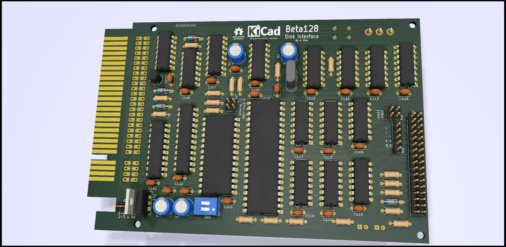
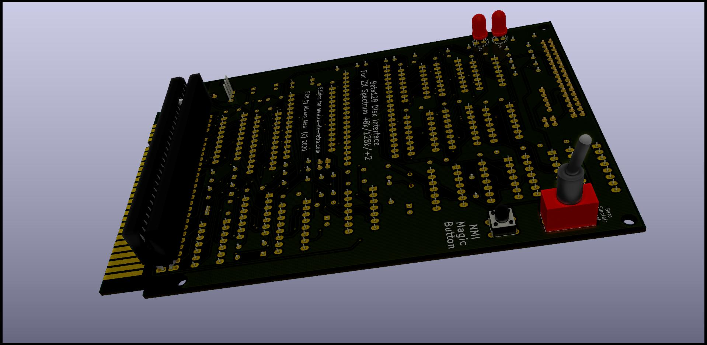

# The Beta 128K Interface Disk for ZX Spectrum
the schematic and PCB for this interfaz, make in KICAD
Including gerber files to direct order, the PCB is just 15x10cm.

# THIS IS WORK IN PROGRESS.ACTUALY THIS INTERFACE DO NOT WORK!!!!! BE AWARE
## NOT FOR USE, THIS IS ONLY A MOCKUP, WORK IN PROGRESS

(C) 2018 Alvaro Alea Fernandez.

This work is licensed under a Creative Commons Attribution-NonCommercial-ShareAlike 4.0 International License.

http://creativecommons.org/licenses/by-nc-sa/4.0/

BOM is probably not acurrate, gerbers have names wrong.

GAL code is not checked

Even this interface provide a back conector for other interfaces, it do not provide a good IORQ signals, so can be incompatible with other interfaces that original interface is working good.

This board hide the serial port on +2.

The Advantege of this interfaz over the original are:

- 4 Banks of ROM, so you can swap between diferent versiones of TR-Dos. selectable by dip-switches
  (TR-DOS 5.03 and 5.04T with fixed, TR-DOS 6.04 & velesoft 5.03 with monitor.

- Posibility of use crossed and plain floppy cable, and invert Drive 1 and Drive 2, very usefull if you have a Gotek and a real floppy.

- Jumper for swap D0 & D7 (because some roms are distributed with this bits swapeed)

